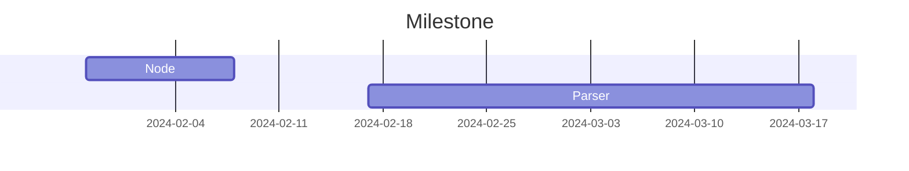
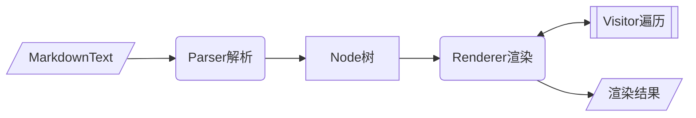

<div align="center">
<h1>commonmark4cj</h1>
</div>

<p align="center">


</p>

## 介绍

用于根据CommonMark规范（以及一些扩展）解析和呈现Markdown文本。

### 特性

- 🚀 解析markdown文本

- 🛠️ Node树状结构

- 💡 遍历/渲染Node树


### 路线



## 软件架构

### 架构



### 源码目录

```shell
├── README.md              #整体介绍
├── doc                    #文档目录，包括设计文档，API接口文档等
│   ├── cjcov              #覆盖率信息
│   ├── design.md          #整体设计文档
│   └── feature_api.md     #API接口文档
├── src                    #源码目录
│   └── commonmark         #描述关键代码文件的功能
└── test                   #测试代码目录
    ├── HLT
    └── LLT
```

### 接口说明

主要类和函数接口说明详见 [API](./doc/feature_api.md)


## 使用说明

### 编译构建

描述具体的编译过程：

```shell
cjpm build
```

### 功能示例

#### Node

markdown解析得到的节点树，不同类型节点为不同的Node子类

示例代码如下：

```cangjie
from commonmark4cj import commonmark.*
    @TestCase
    func test_Node_appendChild():Unit {
        var tb = Text("bb") // node子类
        var ta = Text("aa")
        ta.appendChild(tb)
        var firstChild: ?Node = ta.getFirstChild()
        var lastChild: ?Node = ta.getLastChild()
        @Assert((firstChild.getOrThrow() as Text).getOrThrow().getLiteral(), "bb")
        @Assert((lastChild.getOrThrow() as Text).getOrThrow().getLiteral(), "bb")
        
        var next: ?Node = firstChild.getOrThrow().getNext()
        var prev: ?Node = lastChild.getOrThrow().getPrevious()
        @Assert(next.isNone(),true)
        @Assert(prev.isNone(),true)
        var tc = Text("cc")
        ta.appendChild(tc)
        lastChild = ta.getLastChild()
        firstChild = ta.getFirstChild()
        @Assert((lastChild.getOrThrow() as Text).getOrThrow().getLiteral(), "cc")
        @Assert((firstChild.getOrThrow() as Text).getOrThrow().getLiteral(), "bb")
        
        next = firstChild.getOrThrow().getNext()
        prev = lastChild.getOrThrow().getPrevious()
        @Assert(next.isNone(),false)
        @Assert(prev.isNone(),false)
        @Assert((next.getOrThrow() as Text).getOrThrow().getLiteral(), "cc")
        @Assert((prev.getOrThrow() as Text).getOrThrow().getLiteral(), "bb")
    }
```

#### Parse

解析器 用于将markdown格式的文本解析成对应的Node对象

示例代码如下：

```cangjie
from commonmark4cj import commonmark.*
@TestCase
public func delimiterProcessorWithInvalidDelimiterUse(): Unit {
   let parser: Parser =      Parser.builder().customDelimiterProcessor(CustomDelimiterProcessor(':', 0)).
        customDelimiterProcessor(CustomDelimiterProcessor(';', -1)).build()

    assertEquals("<p>:test:</p>\n", RENDERER.render(parser.parse(":test:")))
    assertEquals("<p>;test;</p>\n", RENDERER.render(parser.parse(";test;")))
}
```

#### Render

使用Visitor遍历Node节点树，在此过程中可自定义节点渲染

示例代码如下：

```cangjie
from commonmark4cj import commonmark.*
@TestCase
public func delimiterProcessorWithInvalidDelimiterUse(): Unit {
   let parser: Parser =      Parser.builder().customDelimiterProcessor(CustomDelimiterProcessor(':', 0)).
        customDelimiterProcessor(CustomDelimiterProcessor(';', -1)).build()

    assertEquals("<p>:test:</p>\n", RENDERER.render(parser.parse(":test:")))
    assertEquals("<p>;test;</p>\n", RENDERER.render(parser.parse(";test;")))
}
```

## 约束与限制
描述环境限制，版本限制，依赖版本等

## 开源协议
FreeBSD

## 参与贡献

欢迎给我们提交PR，欢迎给我们提交Issue，欢迎参与任何形式的贡献。