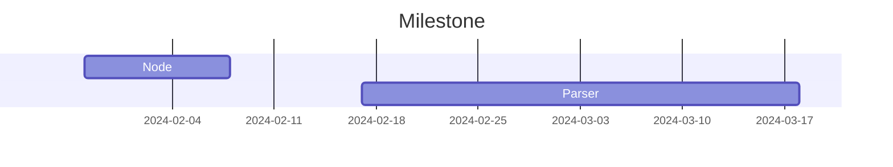
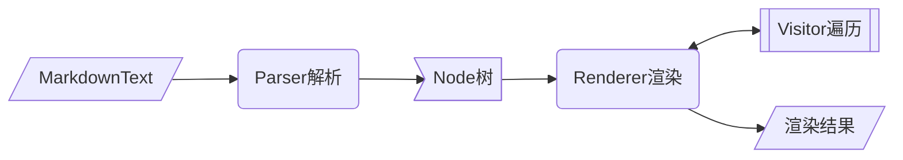

<div align="center">
<h1>commonmark4cj</h1>
</div>

<p align="center">


</p>

## 介绍

用于根据CommonMark规范（以及一些扩展）解析和呈现Markdown文本。

### 特性

- 🚀 解析markdown文本

- 🛠️ Node树状结构

- 💡 遍历/渲染Node树


### 路线



## 软件架构

### 架构



### 源码目录

```shell
├── README.md              #整体介绍
├── doc                    #文档目录，包括设计文档，API接口文档等
│   ├── cjcov              #覆盖率信息
│   ├── design.md          #整体设计文档
│   └── feature_api.md     #API接口文档
├── src                    #源码目录
│   └── commonmark         #描述关键代码文件的功能
└── test                   #测试代码目录
    ├── HLT
    └── LLT
```

### 接口说明

主要类和函数接口说明详见 [API](./doc/feature_api.md)


## 使用说明

### 编译构建

描述具体的编译过程：

```shell
cjpm build
```

### 功能示例
#### xxx 功能示例

功能示例描述:

示例代码如下：

```cangjie
import xxx.*
main() {
 xxxx
}
```

执行结果如下：

```shell
xxx
```

#### xxx 功能示例

功能示例描述:

示例代码如下：

```cangjie
import xxx.*
main() {
 xxxx
}
```

执行结果如下：

```shell
xxx
```

## 约束与限制
描述环境限制，版本限制，依赖版本等

## 开源协议
FreeBSD

## 参与贡献

欢迎给我们提交PR，欢迎给我们提交Issue，欢迎参与任何形式的贡献。