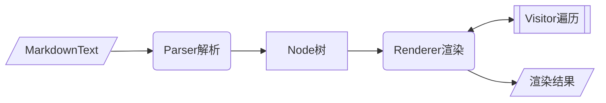

<div align="center">
<h1>markdown hybrid</h1>
</div>

<p align="center">


</p>

## 介绍

用于根据CommonMark规范（以及一些扩展）解析和呈现Markdown文本。
主页 [markdown_hybrid](https://gitcode.com/Cangjie-TPC/commonmark4cj/tree/markdown_hybrid_cangjie-plugin-5.0.13.200)

### 特性

- 🚀 解析markdown文本

- 🛠️ Node树状结构

- 💡 遍历/渲染Node树

## 软件架构

### 架构



### 源码目录

```shell
├── src                    # 互操作包装源码
├── Index.ets              # index
├── CHANGELOG.md           # 修改日志
├── LICENSE                # license 文件
└── README.md              # 整体介绍
```

### 接口说明

`JsNode`主要属性/方法合并自`commonmark.Node`  
详细说明: [commonmark.Node](https://gitcode.com/Cangjie-TPC/commonmark4cj/blob/develop/doc/feature_api.md#1-node)


## 使用说明

### 编译构建

描述具体的编译过程：

```shell
# ohpm 安装
ohpm install @cangjie-tpc/markdown_hybrid
```

### 功能示例

#### 解析markdown文本

示例代码如下：

```typescript
import {
  JsNode as Node,
  parseIntoJsNode,
  ParsedInline,
  Scanner,
  InlineContentParser,
  printNode
} from "@cangjie-tpc/markdown_hybrid"
import { hilog } from "@kit.PerformanceAnalysisKit";

/* 自定义行内解析 */
class MyParser implements InlineContentParser {
  getTriggerCharacters(): Array<string> {
    return ['a']
  }

  tryParse(scanner: Scanner): undefined | ParsedInline {
    // hilog.error(0, 'mod', 'MyParser.tryParse')
    let str = ''
    let line = scanner.lines[scanner.lineIndex]
    let i = scanner.index + 1
    for (; i < line.length; i++) {
      if (line[i] == 'a') {
        i++
        break
      }
      str += line[i]
    }
    let props = new Map<string, string>()
    props.set('str', str)
    return {
      node: {
        nodeType: 'anode',
        props: props
      },
      index: i,
      lineIndex: scanner.lineIndex
    }
  }
}

let markdownString = "0123a56a89"
let myParser: InlineContentParser = new MyParser()
parseIntoJsNode(markdownString, myParser).then(node => {
  let nodeTreeStr = printNode(node)
  hilog.info(0, '', nodeTreeStr)
}
```

执行结果如下：

```
Document{}
    Paragraph{}
        Text{literal=0123}
        anode{[(str, 56)]}
        Text{literal=89}
```

## 约束与限制

    在下述版本验证通过：    
        IDE: DevEco Studio 5.0.5 Release(Build Version:5.0.13.200)  
        Cangjie Plugin: DevEco Studio-Cangjie Plugin 5.0.13.200 Canary (Build Version:5.0.13.200)

## 开源协议

本项目基于 [BSD-2-Clause](https://gitcode.com/Cangjie-TPC/commonmark4cj/blob/develop/LICENSE) ，请自由的享受和参与开源。

## 参与贡献

欢迎给我们提交PR，欢迎给我们提交Issue，欢迎参与任何形式的贡献。